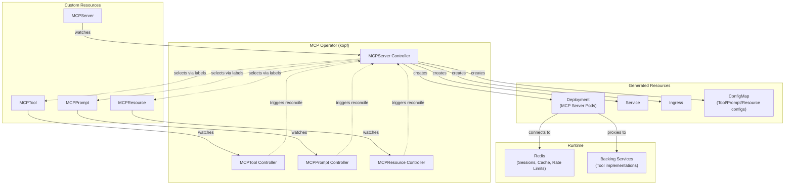

# MCP Kubernetes Operator

## Development Environment

Use conda to activate the Python 3.14 virtual environment:

```bash
conda activate kube-mcp
```

## Quick Commands

```bash
# Install dependencies
make dev                # or: poetry install

# Linting & formatting
make lint               # or: poe lint
make format             # or: poe format
make check              # lint + format-check + typecheck
make fix                # auto-fix lint and format issues

# Testing (80% coverage required)
make test               # or: poe test
make test-fast          # no coverage, stop on first failure

# Run operator in dev mode
make run                # or: poe run
```

## Project Structure

```
mcp-operator/
├── src/
│   ├── controllers/      # kopf controllers for each CRD
│   ├── models/           # Pydantic models for CRDs
│   ├── utils/            # k8s and redis clients
│   └── main.py           # Operator entrypoint
├── tests/
│   ├── unit/             # Unit tests (mocked k8s API)
│   ├── integration/      # Integration tests
│   └── conftest.py       # Pytest fixtures
├── manifests/
│   ├── base/             # Base Kustomize resources
│   │   ├── kustomization.yaml
│   │   ├── namespace.yaml
│   │   ├── crds/
│   │   ├── rbac/
│   │   ├── operator.yaml
│   │   └── redis.yaml
│   └── overlays/
│       ├── dev/          # Local development
│       ├── k3d/          # k3d with local registry
│       └── production/   # Real cluster (ghul)
├── scripts/
│   └── k3d-cluster.sh    # k3d cluster management
├── crd/                  # Original CRD source files
├── Makefile              # Top-level orchestration
└── pyproject.toml        # Poetry + poethepoet config
```

## CRDs

- **MCPServer** (`mcpservers.mcp.example.com`) - Deploys HA MCP server pods
- **MCPTool** (`mcptools.mcp.example.com`) - Defines tools referencing K8s services
- **MCPPrompt** (`mcpprompts.mcp.example.com`) - Defines prompt templates
- **MCPResource** (`mcpresources.mcp.example.com`) - Defines resources (HTTP or inline)

## Architecture



### Key Points

- **Operator Framework**: kopf
- **State Storage**: Redis for HA state (sessions, tool discovery cache, rate limits)
- **Label Selection**: MCPServer uses `toolSelector` to find Tools/Prompts/Resources
- **Service References**: All CRDs reference Kubernetes Services (in-cluster HTTP)

## k3d Test Environment

Use `make k3d-*` commands (or `scripts/k3d-cluster.sh` directly):

```bash
# Create cluster (1 server + 2 agents, local registry at localhost:5000)
make k3d-create

# Install CRDs and Redis
make k3d-crds
make k3d-redis

# Run operator locally against cluster
make run

# Deploy example resources
make k3d-examples

# Cleanup
make k3d-delete
```

For in-cluster deployment:
```bash
make k3d-build    # Build & push to local registry
make k3d-deploy   # Deploy operator to cluster
```

## Kubernetes Contexts

Two contexts configured in `~/.kube/config`:

| Context | Server | Purpose |
|---------|--------|---------|
| `craptastic` | 192.168.0.10:6443 | - |
| `ghul` | 192.168.0.150:6443 | Testing after k3d stage |

```bash
# Switch contexts
kubectl config use-context ghul      # For post-k3d testing
kubectl config use-context craptastic
```

## Deployment with Kustomize

Using Kustomize (built into kubectl) for environment-specific deployments:

```bash
# Deploy to k3d (local development)
make kustomize-k3d       # or: kubectl apply -k manifests/overlays/k3d

# Deploy to production (ghul cluster)
make kustomize-prod      # or: kubectl apply -k manifests/overlays/production

# Preview what will be applied
kubectl kustomize manifests/overlays/k3d
```

### Design Decisions

- **Kustomize over Helm** - No extra tooling, `kubectl apply -k` just works
- **Simple Redis** - Single replica for dev; users bring their own HA Redis for production
- **Helm later** - Can add chart and push to `ghcr.io/<repo>/charts` when needed

## TODO

- [ ] Add integration tests using testcontainers with microk8s or kind (decision TBD)
